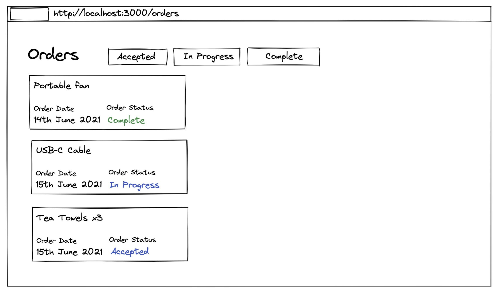

# Orders Component Exersize

## Getting Started

Prerequisites:

- Node v12 (recommended), v10 and higher versions should also work.
- Yarn (v1 by default, v2 may work but is un-tested).

Install and start:

- `yarn`
- `yarn start`
- Begin your implementation

## Exersize

Using TypeScript and React, create a small web application that displays orders. It should look something like this:

Requirements:

- On the home page, a button should be displayed that takes me to /orders (nothing else on home page)
- All orders should be displayed by default on /orders
- Users can filter by Accepted/In Progress/Complete orders (one at a time)
- On the orders page, the page title should contain a number that matches the number of orders currently being displayed (e.g. "(12) My Orders")
- Users can jump between Accepted/In Progress/Complete directly
- When users have an order filter on, it should be displayed at the top of the list, with an "X" button/icon which is used to dismiss the current filter

Please note:

- This project was created with Create React App (with TypeScript support added). You are free to add any tooling at your discretion, if you think it will help you. If you find an issue that is preventing you from doing the task, please contact Sam
- You should consume the order data directly as raw JSON. This is a purely client-side exersize.
- You are not being marked on the visual output. `antd` is included out of the box - it is recommend to use standard antd components. You may wish to write a small amount of CSS for the basic page layout.
- It's expected that the exersize will take 30-60 minutes

## Bonus

For bonus points, provide a written rationale (or implementation if you wish) for how you would cover your work with unit tests. Please note this is **not expected** as we wish to respect candidates' time. This can also be discussed at the following interview.

## Submission

Please send your solution as a .zip to Sam (sam@sgb.io). Please don't include node_modules.

## Feedback

For any clarifications or feedback on this exersize, please contact Sam (sam@sgb.io)
